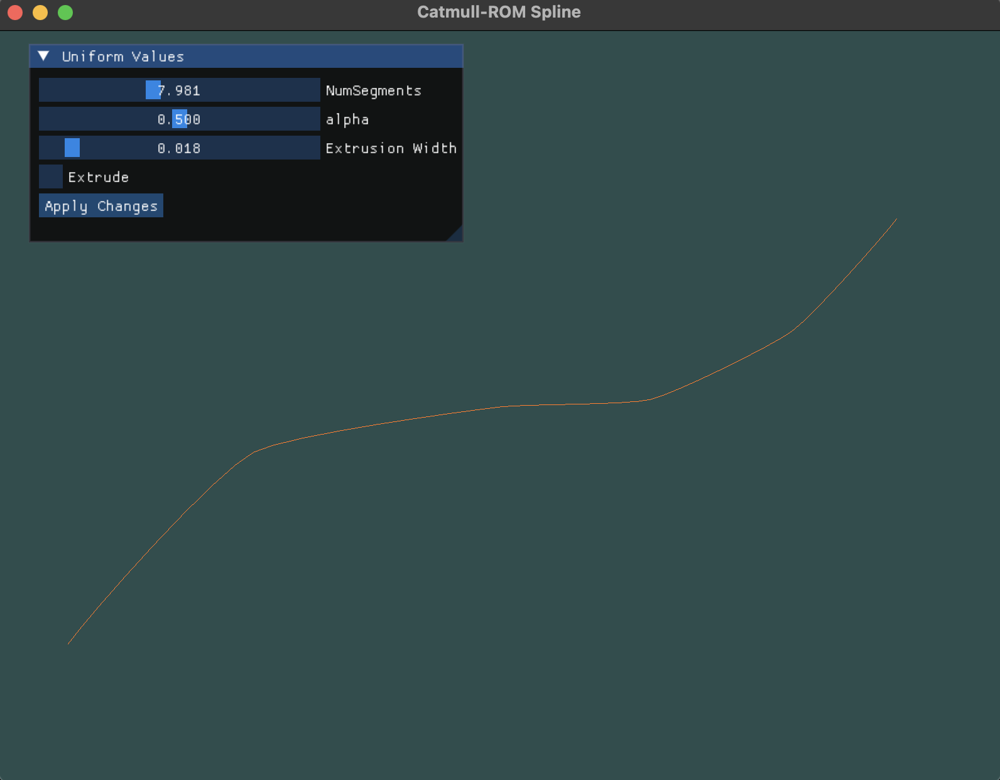
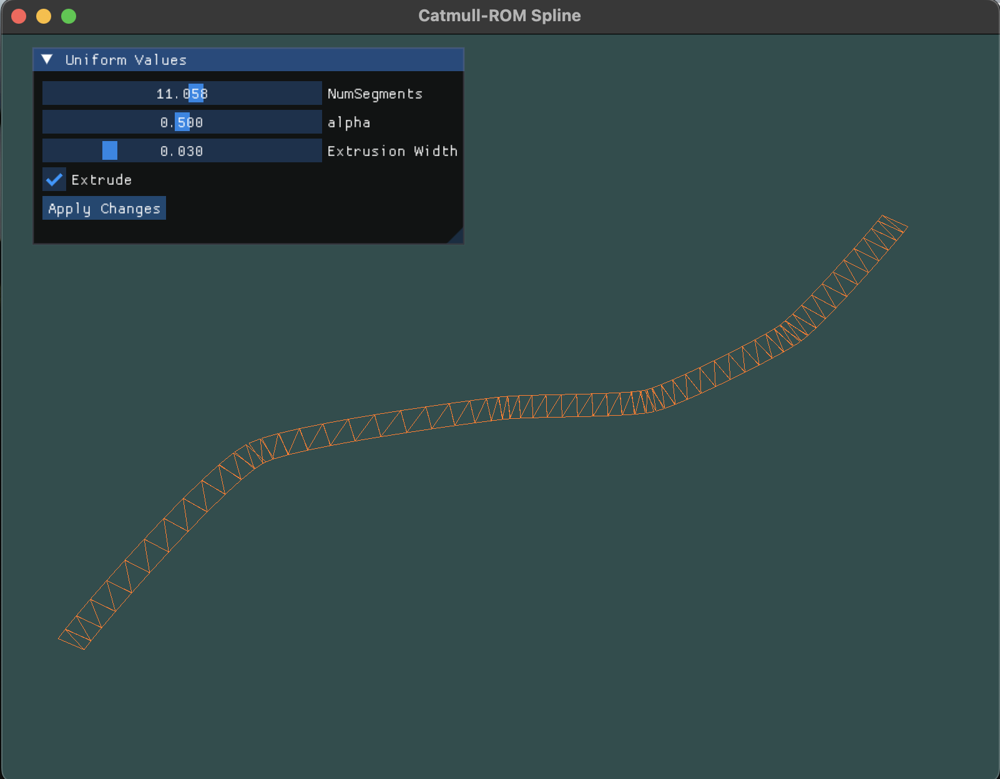

# Catmull–Rom Spline

Catmull–Rom splines are a type of interpolation spline used in computer graphics and computational geometry. They are often employed to create smooth curves between a series of given points, known as control points. The centripetal variant of the Catmull–Rom spline, in particular, offers several advantages over other formulations.

## Types of Catmull–Rom Spline

The Catmull–Rom spline comes in different variants based on the value of a parameter α:

- **Uniform Catmull–Rom Spline**: When α = 0, resulting in a uniform Catmull–Rom spline.
- **Centripetal Catmull–Rom Spline**: When α = 0.5, resulting in a centripetal variant.
- **Chordal Catmull–Rom Spline**: When α = 1, resulting in a chordal variant.

## Advantages of Centripetal Catmull–Rom Spline

The centripetal variant of the Catmull–Rom spline has several desirable mathematical properties compared to other variants:

1. **No Looping or Self-Intersections**: The curve segment formed by the centripetal variant will not exhibit loops or self-intersections.
2. **No Cusps**: Cusps, which are sharp corners in a curve, will never occur within a curve segment generated by the centripetal variant.
3. **Tighter Control Point Following**: The curve closely follows the control points, resulting in smoother and more predictable curves.

## Screenshots

## References

1. [Wikipedia - Centripetal Catmull–Rom Spline](https://en.wikipedia.org/wiki/Centripetal_Catmull%E2%80%93Rom_spline)
2. [Carnegie Mellon University - Catmull-Rom Splines](https://www.cs.cmu.edu/~fp/courses/graphics/asst5/catmullRom.pdf)

## Current Supported System

- MacOS

Feel free to add more information or sections as needed!

